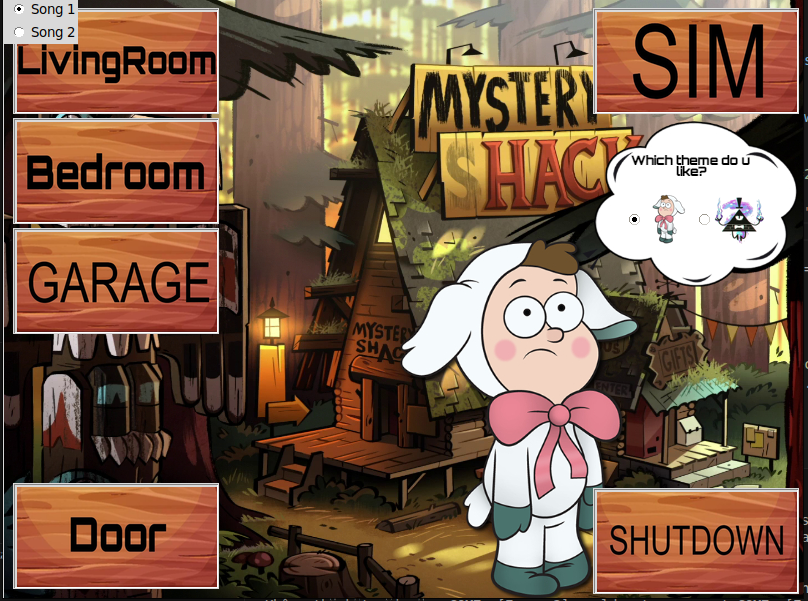
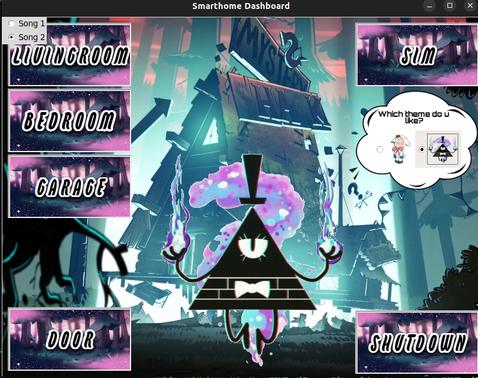

# Smarthome Bill Cipher Dashboard

Ứng dụng điều khiển Nhà thông minh (Smarthome) tích hợp giao tiếp phần cứng Arduino, thiết kế giao diện độc đáo lấy cảm hứng từ nhân vật Bill Cipher (Gravity Falls).

Dự án được xây dựng bằng ngôn ngữ Python, sử dụng thư viện Tkinter/CustomTkinter cho phần giao diện, OpenCV để phát video mở khóa, Pygame làm trình phát nhạc nền, và pySerial để đồng bộ hóa trạng thái với mạch Arduino thực tế.

---

## Giao diện chính của Dashboard

Dưới đây là 2 phong cách giao diện chính của Dashboard Smarthome tương ứng với 2 chủ đề được lựa chọn trong ứng dụng:

### 1. Chủ đề Dipper (Dipper Theme)


### 2. Chủ đề Bill Cipher (Bill Cipher Theme)


---

## Các Tính năng Nổi bật

### Bảo mật và Xác thực Đăng nhập
* Yêu cầu nhập mật khẩu truy cập (mặc định: 1111) với hiệu ứng ẩn mật khẩu.
* Tự động kích hoạt khi gõ đủ 4 chữ số hoặc nhấn Enter.
* **Cảnh báo bảo mật**: Nếu nhập sai quá 3 lần:
  * Đèn LED phần cứng sẽ chớp nháy cảnh báo.
  * Hiển thị màn hình khóa cảnh báo Bill Cipher.
  * Tự động gửi Email cảnh báo qua Gmail tới hòm thư quản trị viên.
  * Tự động tắt ứng dụng để bảo vệ hệ thống.

### Hiệu ứng Mở khóa Sinh động
* Khi đăng nhập thành công, một đoạn video mở khóa ngắn (Video/wc.mp4) sẽ được phát trực tiếp trên màn hình thông qua thư viện OpenCV trước khi chuyển vào bảng điều khiển.

### Nhạc nền tự động theo chủ đề
* Nhạc nền được phát lặp vô tận (loop) bằng pygame.mixer và tự động thay đổi tương ứng với chủ đề giao diện (Dipper Theme & Bill Cipher Theme) được người dùng lựa chọn. Khi đổi chủ đề, hình nền và hệ thống các nút điều khiển sẽ tự động chuyển đổi đồng bộ.

### Quản lý và Điều khiển các Phòng
* **Phòng ngủ (Bedroom)**: Điều khiển Đèn (Bật/Tắt/Nháy) đổi màu hình nền phòng theo chế độ Ngày/Đêm, Mở/Đóng cửa và hiển thị Nhiệt độ thời gian thực.
* **Phòng khách (Living Room)**: Điều khiển Quạt (Bật/Tắt), Đèn chiếu sáng, Đèn nháy và Đóng/Mở cửa ra vào.
* **Nhà xe (Garage)**: Đóng/Mở cửa cuốn garage (Up/Down) và Cửa thông phòng.

### Tích hợp Arduino và Chế độ Giả lập (Dummy Mode)
* Đồng bộ lệnh điều khiển trực tiếp với vi điều khiển Arduino qua giao tiếp Serial.
* **Chế độ Giả lập (DummySerial)**: Nếu không kết nối được mạch Arduino phần cứng (ví dụ: chạy trên máy tính phát triển không cắm dây nối), ứng dụng sẽ tự chuyển sang chế độ giả lập. Toàn bộ lệnh điều khiển sẽ được in ra console và nhiệt độ phòng được giả lập ngẫu nhiên từ 25-27 độ C giúp việc kiểm thử giao diện mượt mà không bị crash ứng dụng.

---

## Cấu trúc Mã nguồn (Modular Architecture)

Dự án được cấu trúc thành các file riêng biệt nhằm phục vụ mục đích mở rộng và bảo trì dễ dàng:

* `main.py`: Điểm chạy chính của ứng dụng, chứa toàn bộ luồng giao diện Tkinter và quản lý trạng thái các phòng thông qua lớp SmartHomeApp.
* `config.py`: Chứa toàn bộ cấu hình tĩnh, tài khoản SMTP gửi mail, thiết lập cổng serial phần cứng và các đường dẫn tài nguyên tĩnh (hình ảnh, âm thanh, video).
* `serial_handler.py`: Quản lý việc kết nối cổng nối tiếp serial với Arduino và tích hợp bộ giả lập DummySerial.
* `email_sender.py`: Tiện ích kết nối SMTP server gửi email cảnh báo bảo mật.

---

## Hướng dẫn Cài đặt và Chạy ứng dụng

### 1. Yêu cầu hệ thống
* Python 3.10 trở lên.
* Máy tính đã cài đặt các thư viện cần thiết.

### 2. Cài đặt các thư viện phụ thuộc
Mở terminal tại thư mục dự án và chạy lệnh:
```bash
pip install customtkinter pillow opencv-python pyserial pygame
```

### 3. Khởi chạy ứng dụng
Chạy file main bằng lệnh:
```bash
python3 main.py
```
> **Mẹo**: Nếu bạn chưa cắm mạch Arduino, chương trình sẽ thông báo lỗi cổng kết nối và tự động khởi chạy giao diện ở chế độ giả lập. Bạn có thể gõ mật khẩu 1111 (lưu ý chuyển bộ gõ sang tiếng Anh để tránh lỗi) để mở khóa trải nghiệm ứng dụng.